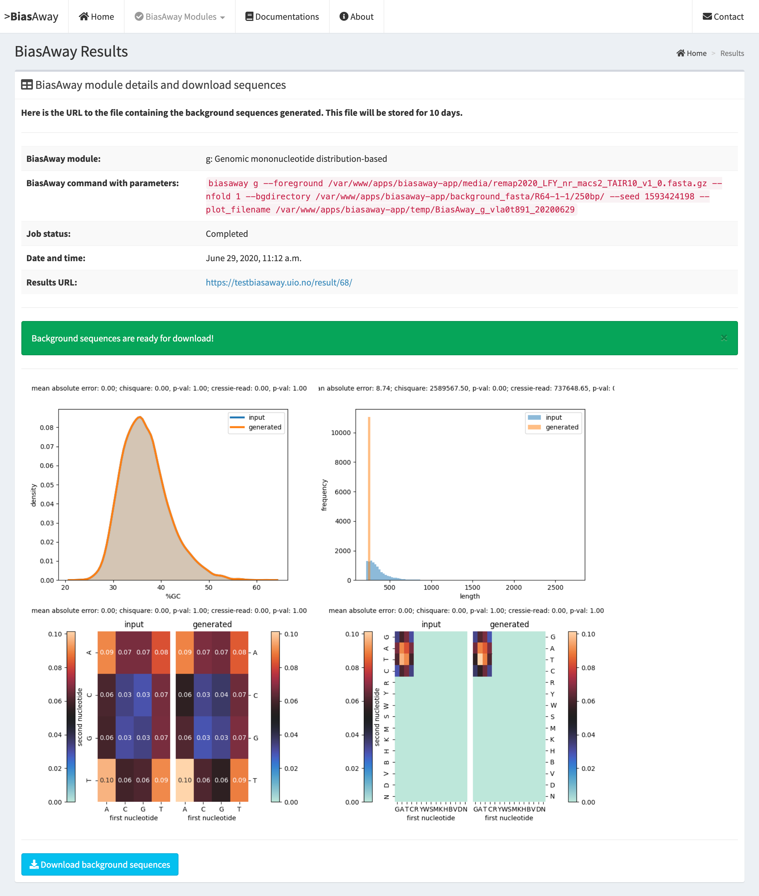

===================
BiasAway web-server
===================

Introduction
============
The BiasAway web-server provides an interactive and easy to use interface for
users to upload FASTA files and to generate background sequences. It comes with
precomputed genomic partitions of 100, 250, 500, 750, and 1000 bp bins for the
genome of nine species (*Arabidopsis thaliana*; *Caenorhabditis elegans*;
*Danio rerio*; *Drosophila melanogaster*; *Homo sapiens*; *Mus musculus*;
*Rattus norvegicus*; *Saccharomyces cerevisiae*; and *Schizosaccharomyces
pombe*). These background sequences are provided through Zenodo at
XXXXXXXXXXXXX. These background sequences were generated using the script at
https://bitbucket.org/CBGR/biasaway_background_construction, which can be used
by users to generate their own background sequences. The result page provides
information about mononucleotide, dinucleotide, and length distributions for
the provided and generated sequences for comparison.

BiasAway has four modules:

.. figure:: img/biasawayapp.png
   :alt: BiasAway Web App

Below are screenshots for individual modules.

K-mer shuffling
===============

This module should be run when the user aims at preserving the global k-mer nucleotide frequencies of input sequences. The model permutes the nucleotides of the target sequences by keeping any k-mer composition of the original sequence selected by the user. For instance, the user can select k=2 to preserve dinucleotide composition, which would conserve CpG distributions.

.. figure:: img/module_k.png
   :alt: BiasAway - K-mer shuffling generator

K-mer shuffling within a sliding window
=======================================

This module should be run when the user aims at preserving the local k-mer nucleotide frequencies of input sequences. This approach is based on a sliding window to consider sub-regions of distinct nucleotide composition within the input sequences, which could be derived from evolutionary changes such as insertion of repetitive sequences, local rearrangements, or biochemical missteps (see module 4 as well). The model generates a background sequence by shuffling the nucleotides within a sliding window W (default 100bp) with a step S (default 50bp) to conserve the local k-mer nucleotide composition for each sequence in the target sequences.

.. figure:: img/module_w.png
   :alt: BiasAway - K-mer shuffling within a sliding window

Genomic mononucleotide distribution matched
===========================================

This module should be run when the user aims at selecting genuine genomic background sequences from a pool of provided genomic sequences to match the distribution of mononucleotide for each target sequence. The model requires both foreground and  a set of genomic background sequences to be drawn as input. We also provide several background options for multiple species to choose from. First, GC composition of each target sequence is computed and sequences are assigned to bins in steps of 1% GC and the same is applied to the background pool of sequences. Then for each target sequence in a given GC bin, it randomly selects a background sequence from the equivalent background 1% GC bin.

.. figure:: img/module_g.png
   :alt: BiasAway - %GC distribution-based background

Genomic mononucleotide distribution within a sliding window matched
===================================================================

This module should be run when the user aims at selecting genuine genomic background sequences from a pool of provided genomic sequences to match the local distribution of mononucleotide for each target sequence. The method requires both foreground and  a set of genomic background sequences to be drawn as input. This module first computes the distribution %GC composition within a sliding window W (default 100bp) and with a step S (default 50bp) for each sequence in the input set of target sequences. Then it matches each target sequence to a background sequence with a similar %GC distribution (mean +/- sd stdev over the sliding windows, default sd = 2.6.

.. figure:: img/module_c.png
   :alt: BiasAway - %GC distribution and %GC composition within a sliding window

Example result page and QC plots
=================================

BiasAway provides quality control (QC) plots and metrics to assess the similarity of the mono- and di-nucleotide, and length distributions for the foreground and background sequences. Specifically, four plots are provided to visualize how similar the foreground and background sequences are when considering.
(2) their distributions of %GC content using density plots, 
(2) their dinucleotide contents considering all IUPAC nucleotides using a heatmap, 
(3) their dinucleotide contents considering adenine, cytosine, guanine, and thymine nucleotides using a heatmap, and 
(4) their distributions of lengths.

Generation of background repositories
=====================================

Modules *g* and *c* of BiasAway require the generation of a background
repository for the genome of interest. This can be created with the script
located at our `BitBucket repository
<https://bitbucket.org/CBGR/biasaway_background_construction/src/master/>`_.

Our `BiasAway Web-Server <https://biasaway.uio.no/>`_ contains precomputed
background repositories for 9 species. The genome fasta files used to create
these can be found below:

* `Homo sapiens: GRCh38/hg38 <https://hgdownload.soe.ucsc.edu/goldenPath/hg38/bigZips/>`_
* `Mus musculus: mm10 <https://hgdownload.soe.ucsc.edu/goldenPath/mm10/bigZips/>`_
* `Rattus norvegicus: Rnor 6.0 <ftp://ftp.ensembl.org/pub/release-100/fasta/rattus_norvegicus/dna/>`_
* `Arabidopsis thaliana: TAIR10 <ftp://ftp.ensemblgenomes.org/pub/plants/release-47/fasta/arabidopsis_thaliana/dna/>`_
* `Danio rerio: GRCz11 <https://hgdownload.soe.ucsc.edu/goldenPath/danRer11/bigZips/>`_
* `Drosophila melanogaster: dm6 <https://hgdownload.soe.ucsc.edu/goldenPath/dm6/bigZips/>`_
* `Caenorhabditis elegans: WBcel235 <ftp://ftp.ensembl.org/pub/release-100/fasta/caenorhabditis_elegans/dna/>`_
* `Saccharomyces cerevisiae <ftp://ftp.ensembl.org/pub/release-100/fasta/saccharomyces_cerevisiae/dna/>`_
* `Schizosaccharomyces pombe: ASM294v2 <ftp://ftp.ensemblgenomes.org/pub/fungi/release-47/fasta/schizosaccharomyces_pombe/dna/>`_

Please note that some genome fasta files are separated by chromosomes in their
original repositories. In that case, please make sure to concatenate all
chromosome fasta files in one single genome fasta file.

Availability
============
The BiasAway web-server is freely available at:

> http://biasaway.uio.no
