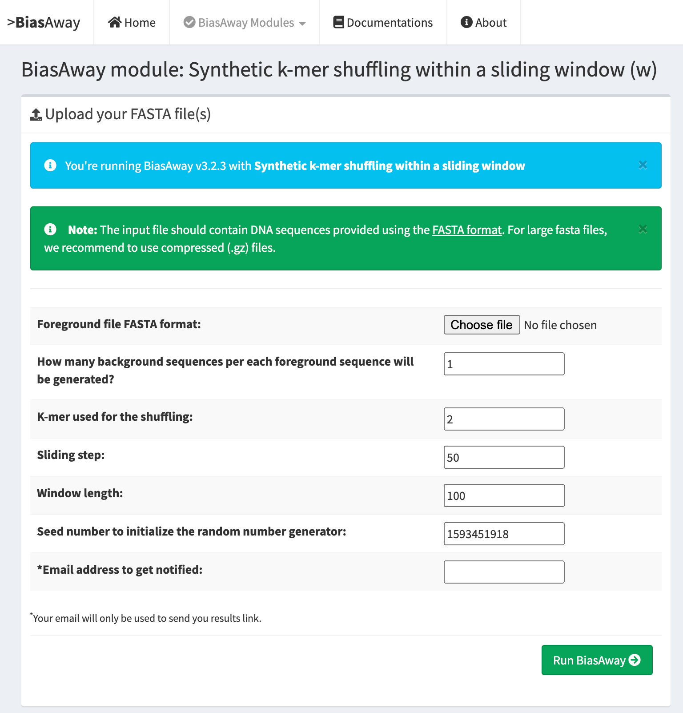

===================
BiasAway web-server
===================

Introduction
============
The BiasAway web-server provides an interactive and easy to use interface for
users to upload FASTA files and to generate background sequences. It comes with
precomputed genomic partitions of 100, 250, 500, 750, and 1000 bp bins for the
genome of nine species (*Arabidopsis thaliana*; *Caenorhabditis elegans*;
*Danio rerio*; *Drosophila melanogaster*; *Homo sapiens*; *Mus musculus*;
*Rattus norvegicus*; *Saccharomyces cerevisiae*; and *Schizosaccharomyces
pombe*). These background sequences are provided through Zenodo at
XXXXXXXXXXXXX. These background sequences were generated using the script at
https://bitbucket.org/CBGR/biasaway_background_construction, which can be used
by users to generate their own background sequences. The result page provides
information about mononucleotide, dinucleotide, and length distributions for
the provided and generated sequences for comparison.

BiasAway has four modules:

.. figure:: img/biasawayapp.png
   :alt: BiasAway Web App

Below are screenshots for individual modules.

K-mer shuffling
===============

.. figure:: img/module_k.png
   :alt: BiasAway - K-mer shuffling generator

K-mer shuffling within a sliding window
=======================================

Genomic mononucleotide distribution matched
===========================================

.. figure:: img/module_g.png
   :alt: BiasAway - %GC distribution-based background

Genomic mononucleotide distribution within a sliding window matched
===================================================================

.. figure:: img/module_c.png
   :alt: BiasAway - %GC distribution and %GC composition within a sliding window

Generation of background repositories
=====================================

Modules *g* and *c* of BiasAway require the generation of a background
repository for the genome of interest. This can be created with the script
located at our `BitBucket repository
<https://bitbucket.org/CBGR/biasaway_background_construction/src/master/>`_.

Our `BiasAway Web-Server <https://biasaway.uio.no/>`_ contains precomputed
background repositories for 9 species. The genome fasta files used to create
these can be found below:

* `Homo sapiens: GRCh38/hg38 <https://hgdownload.soe.ucsc.edu/goldenPath/hg38/bigZips/>`_
* `Mus musculus: mm10 <https://hgdownload.soe.ucsc.edu/goldenPath/mm10/bigZips/>`_
* `Rattus norvegicus: Rnor 6.0 <ftp://ftp.ensembl.org/pub/release-100/fasta/rattus_norvegicus/dna/>`_
* `Arabidopsis thaliana: TAIR10 <ftp://ftp.ensemblgenomes.org/pub/plants/release-47/fasta/arabidopsis_thaliana/dna/>`_
* `Danio rerio: GRCz11 <https://hgdownload.soe.ucsc.edu/goldenPath/danRer11/bigZips/>`_
* `Drosophila melanogaster: dm6 <https://hgdownload.soe.ucsc.edu/goldenPath/dm6/bigZips/>`_
* `Caenorhabditis elegans: WBcel235 <ftp://ftp.ensembl.org/pub/release-100/fasta/caenorhabditis_elegans/dna/>`_
* `Saccharomyces cerevisiae <ftp://ftp.ensembl.org/pub/release-100/fasta/saccharomyces_cerevisiae/dna/>`_
* `Schizosaccharomyces pombe: ASM294v2 <ftp://ftp.ensemblgenomes.org/pub/fungi/release-47/fasta/schizosaccharomyces_pombe/dna/>`_

Please note that some genome fasta files are separated by chromosomes in their
original repositories. In that case, please make sure to concatenate all
chromosome fasta files in one single genome fasta file.

Availability
============
The BiasAway web-server is freely available at:

> http://biasaway.uio.no
