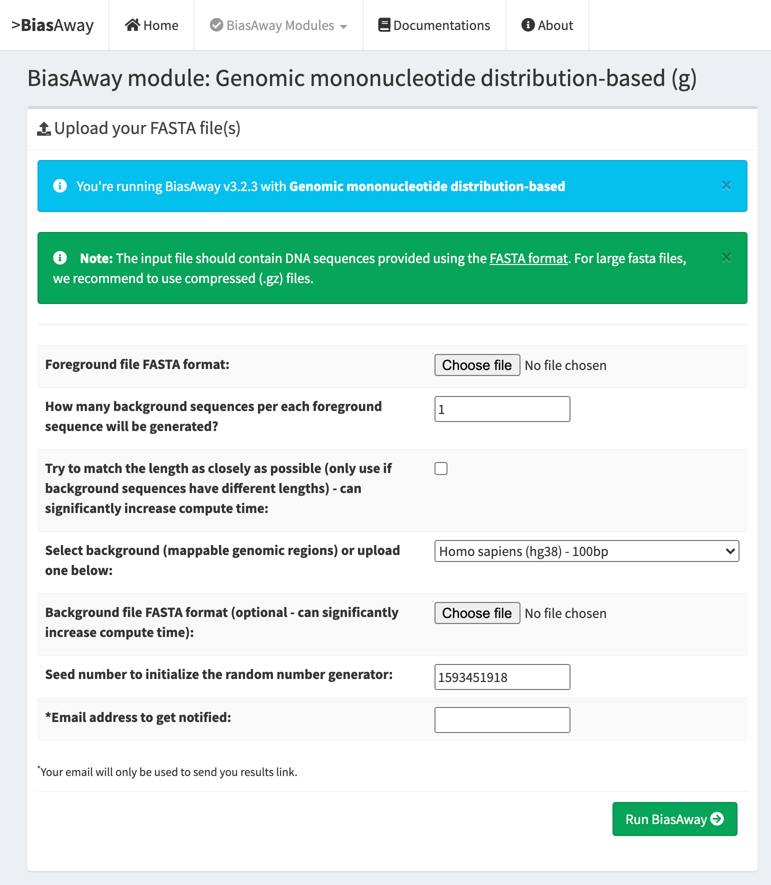
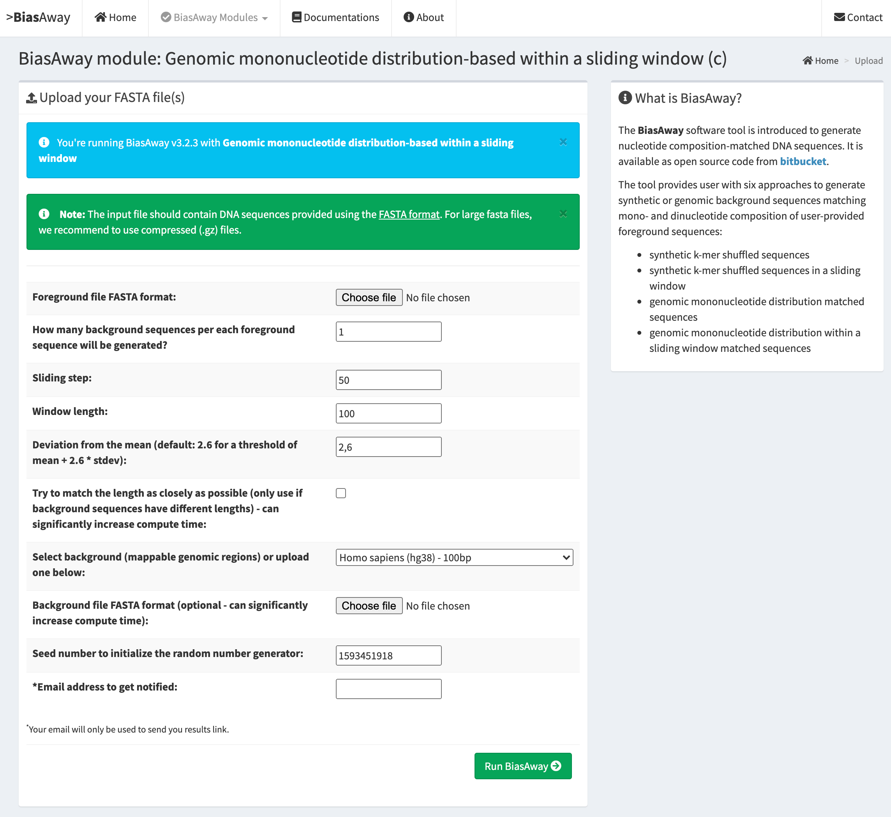

===================
BiasAway web-server
===================

Introduction
============
The BiasAway web-server provides an interactive and easy to use interface for
users to upload FASTA files and to generate background sequences. It comes with
precomputed genomic partitions of 100, 500, and 1000 bp bins for the genome of
nine species (Arabidopsis thaliana; Caenorhabditis elegans; Danio rerio;
Drosophila melanogaster; Homo sapiens; Mus musculus; Rattus norvegicus;
Saccharomyces cerevisiae; and Schizosaccharomyces pombe). These background
sequences were generated using the script at
https://bitbucket.org/CBGR/biasaway_background_construction, which can be used
by users to generate their own background sequences. The result page provides
information about mononucleotide, dinucleotide, and length distributions for
the provided and generated sequences for comparison.

BiasAway has six modules:

.. figure:: img/biasawayapp.png
   :alt: BiasAway Web App

Below are screenshots for individual modules.

Mononucleotide shuffling
=========================

.. figure:: img/module_m.png
   :alt: BiasAway - Mono-nucleotide shuffling

Dinucleotide shuffling
==================================

.. figure:: img/module_d.png
   :alt: BiasAway - Di-nucleotide shuffling generator

Mononucleotide shuffling within a sliding window
==================================================

.. figure:: img/module_f.png
   :alt: BiasAway - Mono-nucleotide shuffling within a sliding window

Dinucleotide shuffling within a sliding window
================================================

.. figure:: img/module_w.png
   :alt: BiasAway - Di-nucleotide shuffling within a sliding window

Genomic mononucleotide distribution matched
===========================================

Genomic mononucleotide distribution within a sliding window matched
===================================================================

Availability
============
The BiasAway web-server is freely available at:

> http://biasaway.uio.no
